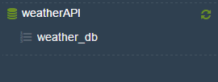
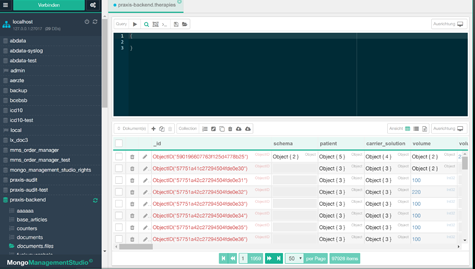
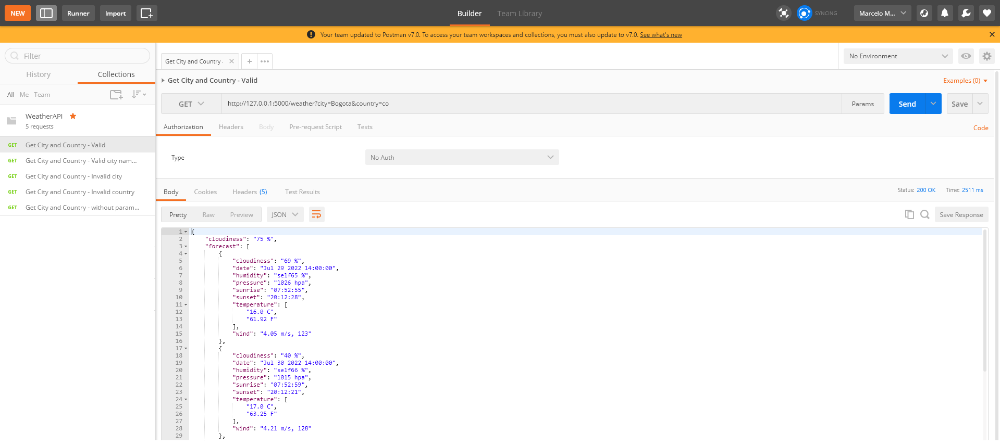
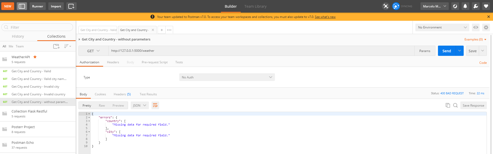

# WeatherAPI
   
## Overview		
    This is a Weather API that uses the OpenWeatherMap service        
      
# Installation      
    To start this project you need to follow the steps below

### Step 1 Cloning the project
    Clone the project to a local directory
    Open the terminal and run the command
    $ git clone https://github.com/marceloMiotto/WeatherAPI.git

### Step 2 (Install all the required libraries)
    Open the terminal and navigate to the projects folder
    Run the command:
        $ py -m pip install -r requirements.txt 

### Step 3 Install MongoDB    
    In case you don't have the MongoDB installed
    Get a version from https://www.mongodb.com/try/download/community

    After installing the mongoDB    
    Open the terminal and navigate to the project's folder
    Run the command:
        $ python utils/create_database_ttl_index.py        

    This should create the database and the ttl index

    The tool that I've used to manage my mongoDB instance is "Mongo Management Studio"
    You could download from here http://mms.litixsoft.de/index.php?lang=en

    I'm using the free version 

### Step 4 Run the project  
    Navigate: local path/WeatherAPI	 
	Run the commands:
	    export FLASK_APP=app
        python -m flask run
			  
		it should starts the server and a message should appear as shown below:
		" * Serving Flask app "app"
          * Environment: production
          WARNING: This is a development server. Do not use it in a production deployment.
          Use a production WSGI server instead.
          * Debug mode: off
          * Running on http://127.0.0.1:5000/ (Press CTRL+C to quit)
        "
		if not, please take a look at "Step 2" 
 		 
### Step 5 Postman
    Install the Postman from https://www.postman.com/downloads/

    Import the test scenarios from WeatherAPI/postman/WeatherAPI.postman_collection.json

    Run the requests manually

    For a valid test scenario you'll probably see something similar to figure below

   
    For an invalid test scenario you'll probably see something similar to figure below

   
   
    